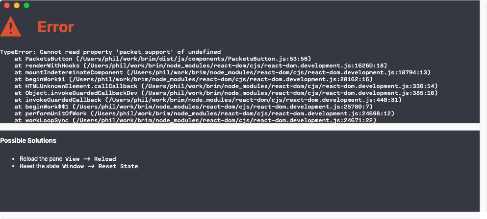
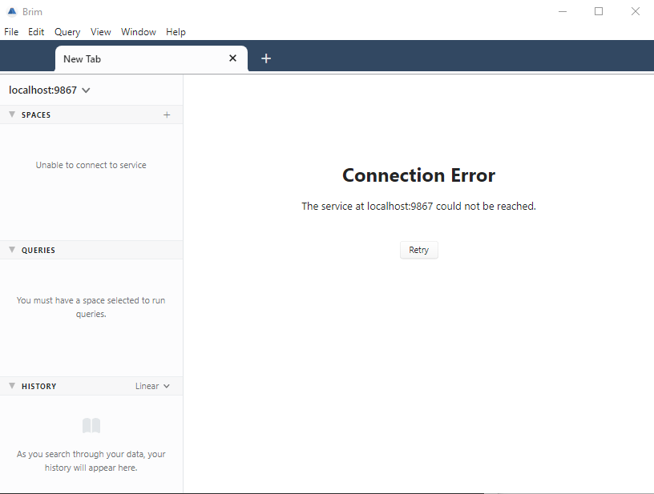
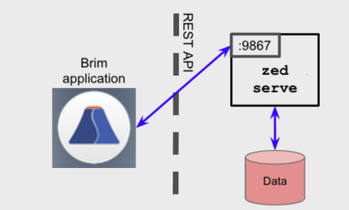
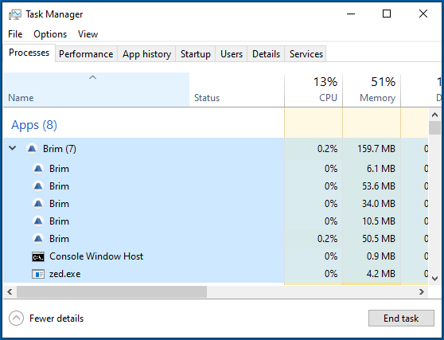
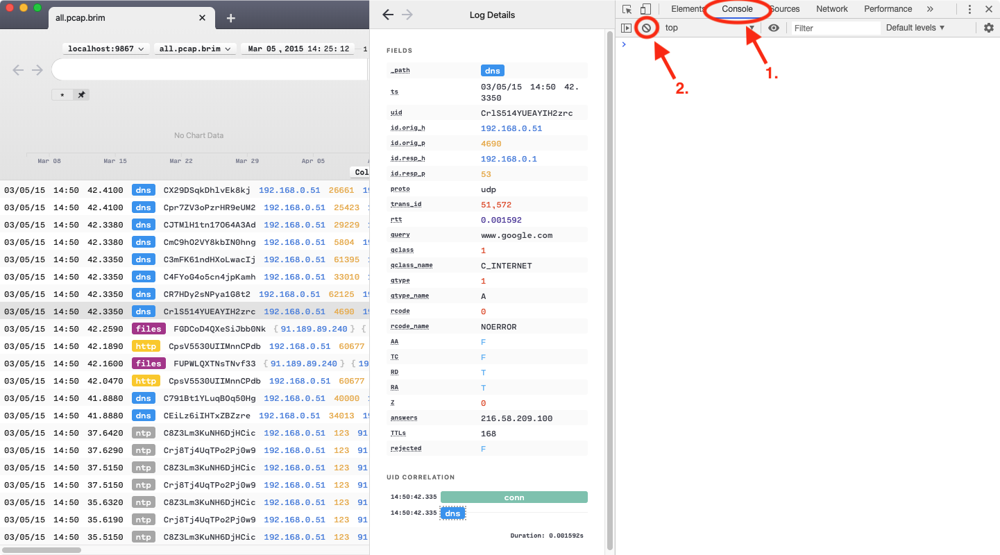

# Troubleshooting

If you're having a problem with Brim, please browse the following sections
before you [open an issue](#opening-an-issue).

- [Common Problems](#common-problems)
  * [I've clicked to open a packet capture in Brim, but it failed to open](#ive-clicked-to-open-a-packet-capture-in-brim-but-it-failed-to-open)
  * [I've clicked in Brim to extract a flow from my pcap into Wireshark, but the flow looks different than when I isolate it in the original pcap file in Wireshark](#ive-clicked-in-brim-to-extract-a-flow-from-my-pcap-into-wireshark-but-the-flow-looks-different-than-when-i-isolate-it-in-the-original-pcap-file-in-wireshark)
  * [Brim seems unable to restart normally, such as after a bad crash](#brim-seems-unable-to-restart-normally-such-as-after-a-bad-crash)
  * [Brim shows "Connection Error: The service at localhost:9867 could not be reached"](#brim-shows-connection-error-the-service-at-localhost9867-could-not-be-reached)
  * [My antivirus software has flagged Brim as potentially malicious](#my-antivirus-software-has-flagged-brim-as-potentially-malicious)
- [Gathering Info](#gathering-info)
  * [Sensitive Information (important!)](#sensitive-information-important)
  * [Screenshots/Videos](#screenshotsvideos)
  * [Developer Tools](#developer-tools)
  * [Logs](#logs)
  * [Sample Packet Captures](#sample-packet-captures)
  * [Large Files](#large-files)
- [Opening an Issue](#opening-an-issue)

# Common Problems

## I've clicked to open a packet capture in Brim, but it failed to open

Functionality related to pcaps in Brim releases `v0.25.0` and newer is
provided via [Brimcap](https://github.com/brimdata/brimcap#usage-with-brim-desktop-app).
This question is covered [here](https://github.com/brimdata/brimcap/wiki/Troubleshooting#ive-clicked-to-open-a-packet-capture-in-brim-but-it-failed-to-open)
in the Brimcap wiki.

## I've clicked in Brim to extract a flow from my pcap into Wireshark, but the flow looks different than when I isolate it in the original pcap file in Wireshark

Functionality related to pcaps in Brim releases `v0.25.0` and newer is
provided via [Brimcap](https://github.com/brimdata/brimcap#usage-with-brim-desktop-app).
This question is covered [here](https://github.com/brimdata/brimcap/wiki/Troubleshooting#ive-clicked-in-brim-to-extract-a-flow-from-my-pcap-into-wireshark-but-the-flow-looks-different-than-when-i-isolate-it-in-the-original-pcap-file-in-wireshark)
in the Brimcap wiki.

## Brim seems unable to restart normally, such as after a bad crash

Though we attempt to fix bad bugs in Brim soon after they're identified,
occasionally you may encounter a new bug that crashes the app in a way that
leaves it in a bad state. In these situations Brim will seem "stuck" each time
it starts, either at at a blank white screen (such as in previously-fixed issue
[brim/1099](https://github.com/brimdata/brim/issues/1099)) or showing an error
dump similar to the one below:



If you experience such a crash, please gather any error dump text and
[open an issue](#opening-an-issue) with as much detail as possible regarding
the steps you followed that led up to the crash.

Then to clear the condition, click **Window > Reset State** from the Brim
pull-down menu. This will clear some cached data from your previous use of Brim
(e.g., the contents of the **History** panel), but the data in your pools will
remain intact.

Before resuming normal work in Brim, this would be a good opportunity to
retrace your steps and confirm that you've captured the reproduction steps
accurately in your [issue](#opening-an-issue), since you won't lose any history
if you repro/crash Brim and clear it one more time. Your assistance in helping
us squash these types of bad bugs is much appreciated. Thank you!

## Brim shows "Connection Error: The service at localhost:9867 could not be reached"

The following screenshot shows how this error is presented in Brim.



These failures are quite rare. Brim is regularly tested for successful
installation in "out-of-the-box" configurations of all supported platforms, so
it's likely that this type of failure may be due to some unique configuration
on your system that's preventing normal operation. Therefore, even if the tips
below help you get past the problem, it would be very helpful for you to still
share the details with us so we can provide guidance to ensure other users
avoid the problem in the future.

There have been a couple reports from Windows users who experienced these
symptoms after an upgrade to a newer Brim release. In each case the users
ultimately resolved the problem via system reboot. We've unfortunately been
unable to reproduce this problem or study a system "live" that's in this state
to determine the root cause or why the reboot fixed it. An issue
[brim/1490](https://github.com/brimdata/brim/issues/1490) is being kept open to
track this specific case. Even though a reboot might be an effective fix for
you also, your assistance would be much appreciated in still running
through the troubleshooting steps below and gathering the debug information.
If you ultimately find a reboot fixes the symptom for you, please add your logs
and details to [brim/1490](https://github.com/brimdata/brim/issues/1490).
In all other cases, please [open a new issue](#opening-an-issue).

To begin troubleshooting this, it helps to understand the "backend" of Brim.
One essential component is a [Zed lake](https://zed.brimdata.io/docs/commands/zed/#1-the-lake-model),
a server-style process that manages the storage and querying of imported data.
Operations in the pools of a Zed lake are invoked via a [REST
API](https://zed.brimdata.io/docs/lake/api/) that's
utilized by a "client", such as the Brim app. When run on your desktop,
`zed serve` is launched at startup by Brim and then listens for such API
connections on local TCP port `9867`.



Therefore, this particular error message indicates that for some reason Brim
was not able to successfully communicate with a `zed serve` process via
`localhost:9867`. In brief, the root cause is likely one of the following:

1. [A `zed serve` crash](#a-zed-serve-crash)
2. [A failure to launch `zed serve`](#a-failure-to-launch-zed-serve)
3. [No local communications between Brim and `zed serve`](#no-local-communications-between-brim-and-zed-serve)

In all cases, you should plan to [open an issue](#opening-an-issue) with
Brim/Zed logs attached, as these may include crash/failure details. However,
for situations other than simple crashes, the problem may be related to
antivirus tools that could block the install/upgrade of software and/or
firewalls that block communications between unfamiliar processes. You may
therefore need to work with your IT department to examine logs from such
utilities and determine if settings can be adjusted to allow Brim to operate.

The sections below describe additional debug you can perform to narrow down
among the above root causes. Please include your findings from these steps in
any issue you open, along with Brim/Zed logs and details on how you
reproduced the error.

### A `zed serve` crash

If you experience the error during normal operations in Brim (e.g., after you've
attempted to execute a query in the middle of an otherwise healthy session),
it's possible that the `zed serve` process suffered a fatal crash. If you
can reliably reproduce the crash by executing a particular query and/or with a
particular data source, please include this detail in your issue along with
attached logs.

### A failure to launch `zed serve`

If you experience the error when launching Brim (perhaps after an auto-update
to a new release), it's possible that system utilities prevented the
`zed serve` process from fully installing or starting. To narrow down if
this is occurring, it may help to compare the current running state to that of
a healthy installation.

Once you've launched Brim and have observed the error message, check the
running processes on your system and compare to the outputs shown below as
appropriate for your platform.

**Windows (Task Manager)**



**Linux [`pstree`](https://man7.org/linux/man-pages/man1/pstree.1.html)**

```
$ pstree
...
        |      |                 |               |-gnome-session-b-+-gnome-shell-+-brim-+-brim---brim-+-brim
        |      |                 |               |                 |             |      |             `-4*[{brim}]
        |      |                 |               |                 |             |      |-brim---brim
        |      |                 |               |                 |             |      |-brim---5*[{brim}]
        |      |                 |               |                 |             |      |-2*[brim---12*[{brim}]]
        |      |                 |               |                 |             |      |-zed---9*[{zed}]
        |      |                 |               |                 |             |      `-31*[{brim}]
```

**macOS [`pstree`](https://man7.org/linux/man-pages/man1/pstree.1.html)**

```
$ pstree
...
 |-+= 67726 phil /Applications/Brim.app/Contents/MacOS/Brim
 | |--- 67727 phil /Applications/Brim.app/Contents/Frameworks/Brim Helper (GPU).app/Contents/MacOS/Brim Helper (GPU) --type=gpu-process --field-trial-handle=1718379636,158416190604165762
 | |--- 67729 phil /Applications/Brim.app/Contents/Resources/app.asar.unpacked/zdeps/zed serve -l localhost:9867 -R /Users/phil/Library/Application Support/Brim/data/lake -log.level
 | |--- 67730 phil /Applications/Brim.app/Contents/Frameworks/Brim Helper.app/Contents/MacOS/Brim Helper --type=utility --utility-sub-type=network.mojom.NetworkService --field-trial-hand
 | |--- 67731 phil /Applications/Brim.app/Contents/Frameworks/Brim Helper (Renderer).app/Contents/MacOS/Brim Helper (Renderer) --type=renderer --field-trial-handle=1718379636,15841619060
 | \--- 67732 phil /Applications/Brim.app/Contents/Frameworks/Brim Helper (Renderer).app/Contents/MacOS/Brim Helper (Renderer) --type=renderer --field-trial-handle=1718379636,15841619060
```

If `zed` is absent from these outputs, it's possible that another process is
already running that's listening on TCP port 9867. To confirm this, completely
exit Brim and run `netstat -an` and look for instances of `:9867`.

If no such process is found, examine the logs of system utilities (perhaps
with assistance from an IT department) to look for indications of the `zed`
binary not having been fully installed (such as during auto-update to a
new release) or prevented from being launched.

### No local communications between Brim and `zed serve`

If the process tables indicated `zed` is running, the next thing to consider
is the local network connectivity. In an "out-of-the-box" desktop environment,
not only would Brim have been able to connect, but a direct connection from a
browser to `http://localhost:9867` would cause the following informational
message to be returned by `zed serve`.


It may help to use Wireshark to sniff TCP port 9867 traffic on your system's
loopback interface while attempting to access this URL in your browser. This
may help determine if packets are failing to make it to `zed`, not being
returned from `zed`, and/or if some other process is getting in the way of the
communications. It may be necessary to examine firewall logs (perhaps with
assistance from an IT department) to look for evidence of the connection
having been blocked.

## My antivirus software has flagged Brim as potentially malicious

We've been made aware that the Windows binary `suricata-update.exe` has been
flagged by several antivirus engines, as summarized in<!-- markdown-link-check-disable -->
[this VirusTotal entry](https://www.virustotal.com/gui/file/b184511d689d547fa5fd524c7ca120586fcffc60f338f932d41800c63961d723/detection).<!-- markdown-link-check-enable-->
If your antivirus software should flag a different Brim-related binary as
potentially malicious, please [open an issue](#opening-an-issue), as we'd
want to investigate that as well.

Specifically regarding the Windows binary `suricata-update.exe`, we strongly
believe this to be a "false positive". However, we understand that users may
still have concerns. Thankfully the code and tools involved in building
the binary are all open source, so we encourage users to perform their own
assessment as to whether they feel safe installing and using the software. As
we don't claim deep expertise in antivirus matters, we'd also welcome input
from experienced members of the Brim community on ways we can best address
the topic. Please come talk to us on [public Slack](https://www.brimdata.io/join-slack/)
if you feel you could offer further assistance.

It may be helpful to first understand the role of this binary. As the name
suggests, the binary is part of the [Suricata threat detection engine](https://suricata.io/)
that's bundled with Brim as part of the [Brimcap](https://github.com/brimdata/brimcap)
tool that generates summary logs from packet captures. When used in a default
configuration, Brim invokes Suricata's update utility each time the app
launches to ensure the most recent threat rules are locally cached such that
accurate alerts can be generated from pcaps you import into Brim.

Considering how the tool functions and how Brim uses it, it becomes plausible
that a conservative antivirus engine may perceive the observed network
behavior as consistent with that of ["backdoor"](https://en.wikipedia.org/wiki/Backdoor_(computing))
malware that may reach out to arbitrary network destinations in the name of
transmitting sensitive information or providing network channels for
nefarious remote logins. Of course, the [functionality of Suricata-Update](https://suricata.readthedocs.io/en/suricata-6.0.0/rule-management/suricata-update.html)
as described by the OISF is quite benign: In its default
configuration as it's used by Brimcap and Brim, the network destinations it
reaches out to are servers associated with providing the
[Emerging Threats Open](https://rules.emergingthreats.net/open/) ruleset.

Having established its benign nature, a likely follow-on concern would be
whether it has been altered in the process of bundling it for use with the app.
Indeed, the Suricata-Update tool in its original form is written in Python and
in a normal Suricata install, users are responsible for having a compatible
Python installation that's capable of running the tool. This seems a reasonable
expectation for the types of servers on which Suricata is often installed.
However, since it is our intent for Brim to be desktop software that's easy
to install, we felt that bundling Python with Brim would bring excessive
bloat, and we felt requiring users to maintain a working Python installation
as a prerequisite for having valid alerts would be a heavy burden. It's for
this reason that we made the decision to use the popular [PyInstaller](https://www.pyinstaller.org/)
tool to "freeze" Suricata-Update into standalone executables that could be
bundled with each platform and hence run without external dependencies.

If you wish to perform your own audit to confirm that the executable has not
been tampered with in the build process, below are some pointers to trace
its origin.

* A Brim-managed [fork of suricata-update](https://github.com/brimdata/suricata-update) holds a
  copy of the [original OISF repo](https://github.com/OISF/suricata-update).
  As of Brim
  release `v0.25.0`, the fork is holding a copy of the OISF repo as of tag
  `1.2.0`.

* A branch [`fix-windows`](https://github.com/brimdata/suricata-update/tree/fix-windows)
  exists in the Brim-managed repo that includes minimal changes that we found
  necessary for the executable to build and run on Windows. The total set of
  changes can be reviewed [here](https://github.com/brimdata/suricata-update/compare/1.2.0...0b10a83).

* A [build-suricata repo](https://github.com/brimdata/build-suricata) contains automation that's
  used to create the Suricata packages that are bundled with Brimcap. This
  includes [script code](https://github.com/brimdata/build-suricata/blob/9847f9ba72b24a132aa7068a15b9d3ff9e63af1b/.github/workflows/windows-build.yaml#L103-L109)
  that unpacks the enhanced Suricata-Update and runs PyInstaller to generate the
  `suricata-update.exe` executable. The same automation also creates the
  Suricata artifacts on the repo's
  [GitHub Releases](https://github.com/brimdata/build-suricata/releases) page.

* The [Brimcap repo](https://github.com/brimdata/brimcap) then has its own
  [release automation](https://github.com/brimdata/brimcap/blob/4fc6d62e8e12f0949074225274c3f9ea3074344c/.github/workflows/ci.yaml#L43)
  which [downloads the Suricata artifact](https://github.com/brimdata/brimcap/blob/4fc6d62e8e12f0949074225274c3f9ea3074344c/Makefile#L41) which is bundled
  into [Brimcap releases](https://github.com/brimdata/brimcap/releases).

* Each Brim release points at a [Brimcap release](https://github.com/brimdata/brim/blob/b288fae1654bd6b848a0714583f6570d22e91d97/package.json#L68)
  that's bundled by Brim's own [release automation](https://github.com/brimdata/brim/blob/v0.25.0/.github/workflows/win-release-candidate.yml).

To summarize, the executable consists of a minimally-enhanced Suricata-Update that's been
turned into an executable by other open source tools. If your conclusion
matches our own that this is a "false positive", you can help others by
[flagging it as harmless in VirusTotal](https://support.virustotal.com/hc/en-us/articles/115002146769-Comments),
as multiple community members have already done.

# Gathering Info

Before [opening an issue](#opening-an-issue), or while debugging a
previously-opened issue, there's detail you can gather that may help us more
quickly provide you with a resolution.

## Sensitive Information (important!)

For all information described in this section, we understand that some of it
may be of a sensitive nature such that you don't feel you can attach it
directly to a public GitHub Issue. If you can crop, blur, or otherwise modify
the information before attaching, please do. If you feel you could share such
information only privately, please notify us on [public Slack](https://www.brimdata.io/join-slack/)
and we can arrange to receive it from you in a private 1-on-1 chat.

## Screenshots/Videos

If you think you've encountered a bug, a screenshot or recorded desktop video
of your Brim app that includes the error message or unexpected behavior may
help us a lot. If you can annotate your media with arrows, text, or other
detail, even better. The same is true if you're submitting a detailed feature
request.

## Developer Tools

Most of Brim's error messages should be surfaced within the app and include
enough detail for us to figure out the problem. However, if you've uncovered a
challenging bug, we may need your help to gather some additional detail. For
instance, this may come up with bugs where you're clicking in the app and you
expect a certain outcome but nothing seems to be happening.

A more detailed level of debug info may be hiding in a _Developer_ _Tools_ area
that's available in Brim, and it may help us a lot if you could check there to
see if more error info is being generated when you reproduce a problem. This
will work best with bugs that you can reliably reproduce.

To prepare, get to the point in the Brim app where you're _about_ _to_ trigger
the problem, but have not triggered it yet. Then from the menu bar, select
**View > Toggle Developer Tools**. This will reveal a new panel on the right
side of the app window, as outlined in red below.


Once the panel is revealed, inside it first click to the **Console** tab, then
click the circle with the line through it to clear the console of any existing
messages.



Now perform the operation in the app that triggers the problem. Hopefully this
will reveal some error messages in the **Console** area of the panel. If this
is the case, please take a screenshot and include it with your issue.

## Logs

Logs are generated by the Brim app and the `zed serve` process it
launches (the engine for querying your data). These are located in the
`logs` subdirectory under the Brim [user data](https://github.com/brimdata/brim/wiki/Filesystem-Paths#user-data)
path.

Please include a ZIP of the contents of this directory along with any issue
you open to report a bug.

## Sample Packet Captures

If your problem involves a pcap file, we'll likely be able to debug much quicker
if you can attach a sample pcap file to your issue. If you are able to
reproduce the issue using a small pcap that you're certain does not contain
sensitive information, that would be ideal.

## Large Files

If you have a video or sample pcap that is too large to attach to a GitHub
Issue, please upload it to the file-sharing service of your choosing and paste
a link to it in your issue.

# Opening an Issue

Before/when [opening a new issue](https://github.com/brimdata/brim/issues/new/choose),
you can help us out by doing the following:

* Review the [common problems](#common-problems) above see if you're hitting one of those.
* Browse the existing [open issues](https://github.com/brimdata/brim/issues?q=is%3Aissue+is%3Aopen). If you confirm you're hitting one of those, please add a comment to it rather than opening a new issue.
* [Gather info](#gathering-info) that may help in reproducing the issue and testing a fix, and attach it to your issue.
* Feel free to chat with the team on the [public Slack](https://www.brimdata.io/join-slack/) before/after opening an issue.
* When you open a new issue, its initial text will include a template with standard info that will almost always be needed. Please include detail for all areas of the template.

Thanks for helping us support the Brim community!
